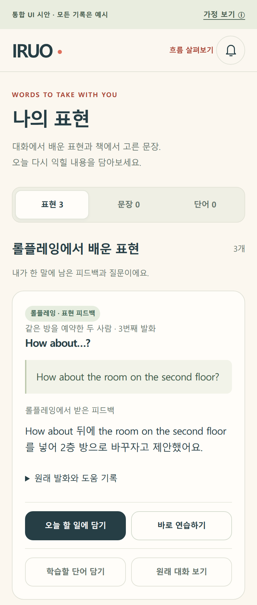
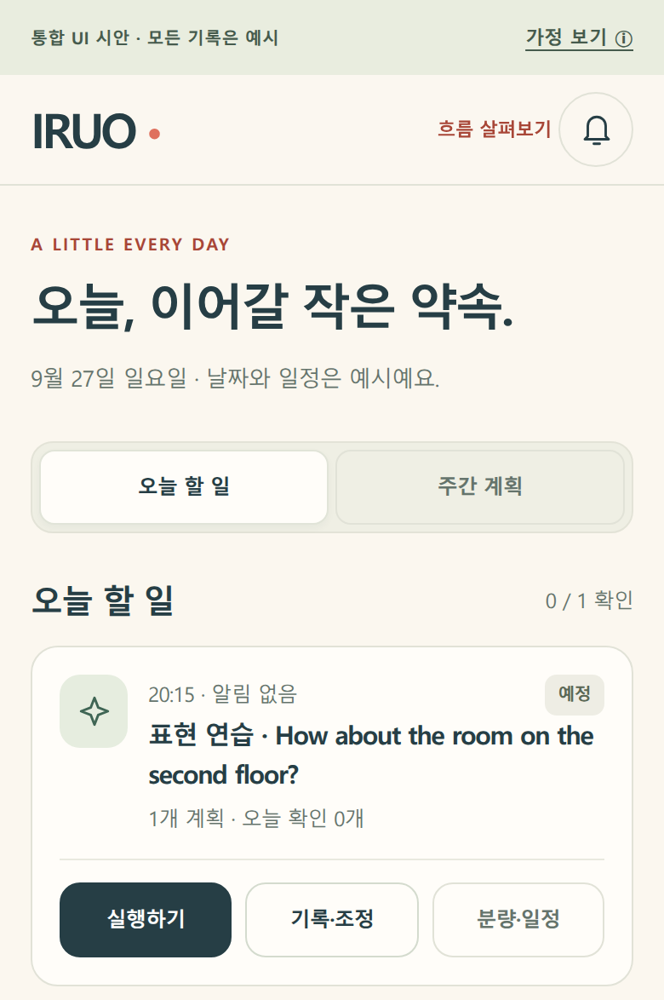

# IRUO — 학습할 표현을 오늘 계획에 담기

IRUO는 학습자의 상태에 맞춘 학습을 돕기 위해 개발 중인 영어 학습 서비스입니다. 과정에 등록한 프로젝트명은 **‘학습자의 진단 결과를 기반하여 학습 커리큘럼을 짜주는 서비스’**입니다. 이번 활동 자료에서는 **나의 표현에서 학습할 표현 선택 → 오늘 할 일에 담기** 기능의 UI 시안을 소개합니다.

작성일: 2026-09-27 · 분야: 영어교육·에듀테크 · 결과물 형태: 모바일 웹 UI 시안

## 기능 예시

학습자는 ‘나의 표현’에서 연습하고 싶은 항목을 고르고, 선택한 항목을 ‘오늘 할 일’에 담아 학습 계획으로 확인합니다.

아래 이미지는 실제 UI 시안 화면에서 이번 기능에 필요한 부분만 발췌한 모바일 캡처입니다. 전체 메뉴와 다른 기능은 생략했습니다.

**1. 나의 표현에서 학습할 표현 선택**

**2. 선택한 표현을 오늘 할 일에서 확인**

두 화면의 같은 표현이 연결되어 있습니다. 할 일에 추가된 항목은 ‘예정’으로 표시되며, 계획에 담은 것만으로 학습을 완료한 것으로 처리하지 않습니다.

## 구현 상태와 활용 계획

- **현재 상태:** HTML·CSS·JavaScript로 만든 UI 시안이며, 화면에는 샘플 데이터를 사용했습니다. 실제 AI 진단·추천·평가는 아직 구현하지 않았습니다.
- **시안의 가정:** 화면의 구성과 동작은 사용성을 검토하기 위한 가정이며, 확정된 운영 정책이 아닙니다.
- **활용 계획:** 학습 항목을 선택하고 오늘 계획으로 연결하는 과정의 사용성을 검토한 뒤, 확인한 내용을 실제 기능 개발에 반영할 계획입니다.
- **오픈소스 검토:** [6주차 Agent Lab](https://github.com/2026-ai-service-engineering-a/week06-agent-lab)은 참고 검토 단계이며, 이번 UI 시안에 해당 코드를 실제 적용하지 않았습니다.
