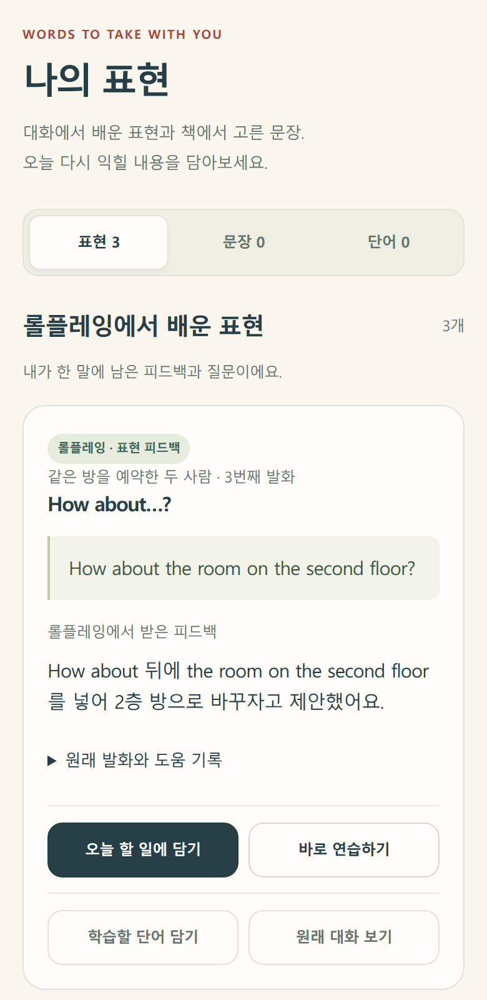
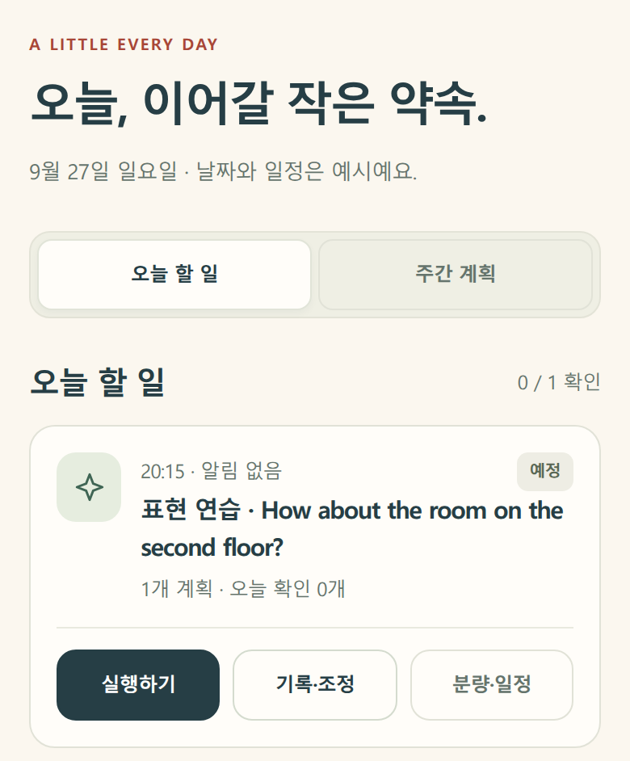

# 학습 계획 화면

2026.09.27

연습할 표현을 골라 오늘 할 일에 담는 모바일 화면을 만들었습니다. 고른 표현이 오늘 할 일에도 같은 내용으로 표시되는지 확인했습니다.

아래는 화면의 일부입니다. 영어 문장과 시간, 학습 분량은 테스트용으로 넣었습니다. 아직 AI는 연결하지 않았습니다.

### 연습할 표현 고르기

목록에서 연습할 표현을 고르고 ‘오늘 할 일에 담기’를 누릅니다.

### 오늘 할 일에 추가하기

선택한 표현이 오늘 할 일에 추가됩니다. 아직 공부하기 전이라 ‘예정’으로 표시됩니다.

